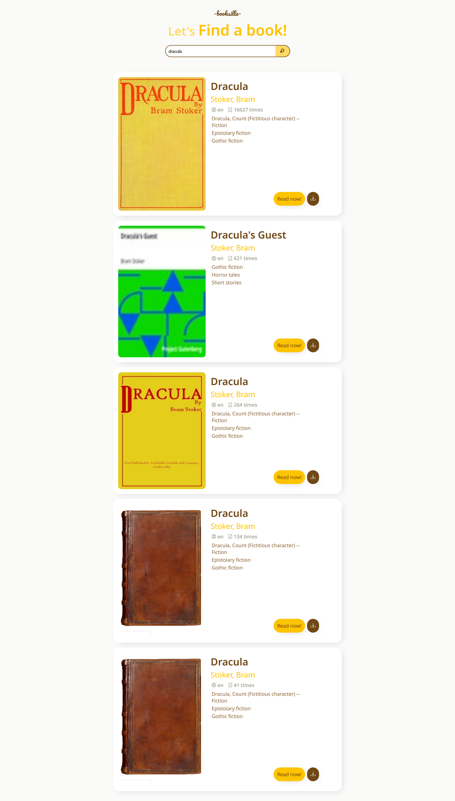
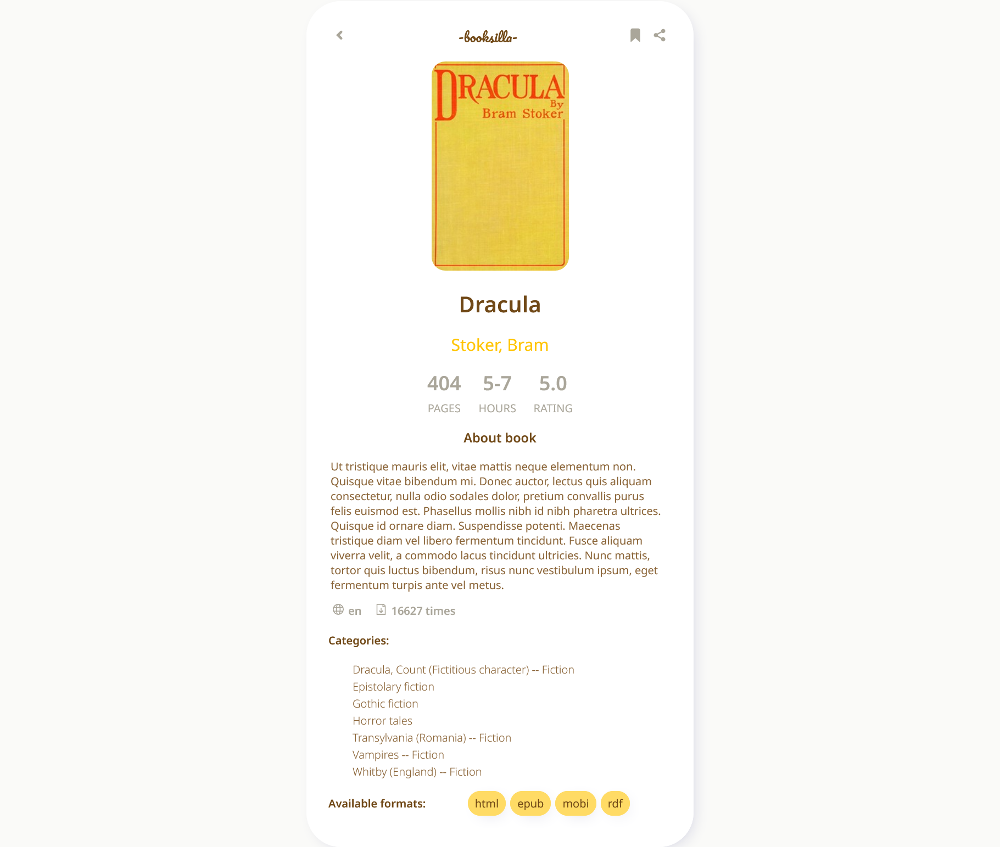

# Booksilla - website for searching and reading free books

Based on the Gutenberg Project.

## ✨ Overview

### 📷 Screenshots

### 🎯 Features

- API integration with https://gutendex.com/books
- RWD

### 💎 Pages

- Search Page
- Single Book Page

### 🚀 Tech stack

- React 18
- Styled Components
- Axios

## 🏃‍♀️ Run locally

### Clone the project

`git clone https://github.com/dboinska/booksilla`

### Go to the project directory

`cd booksilla`

### Install dependencies

`npm install`

### Start the server

`npm start`
